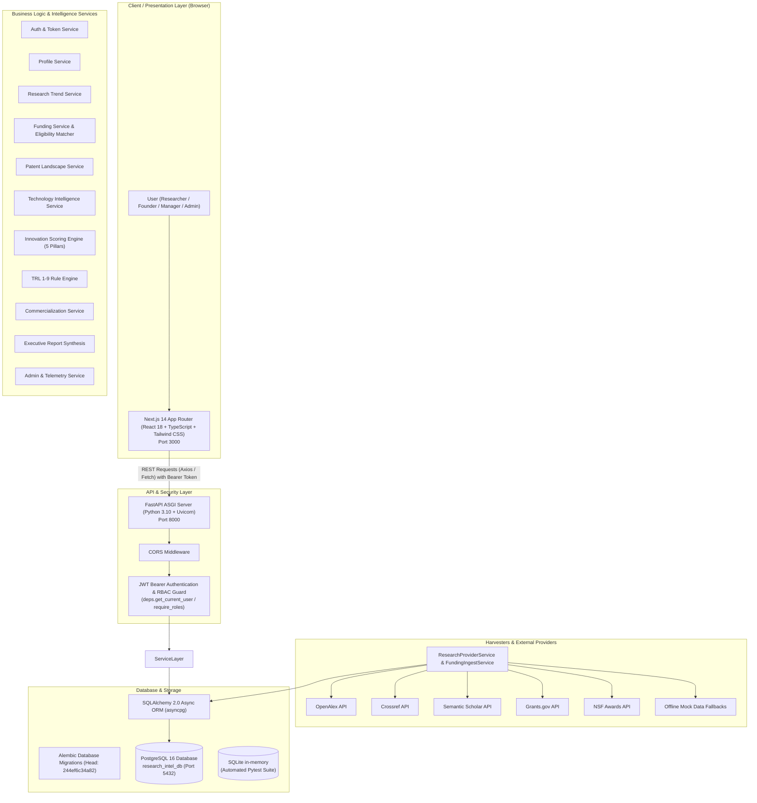
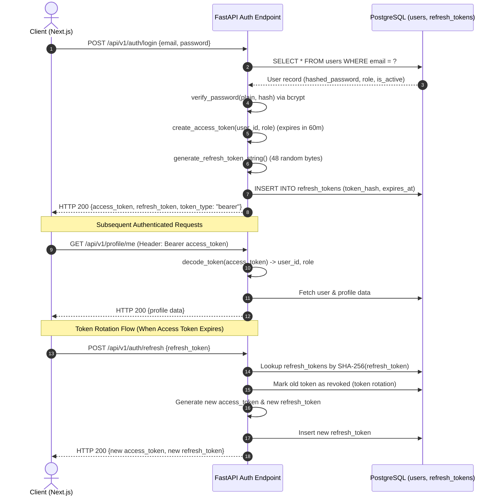
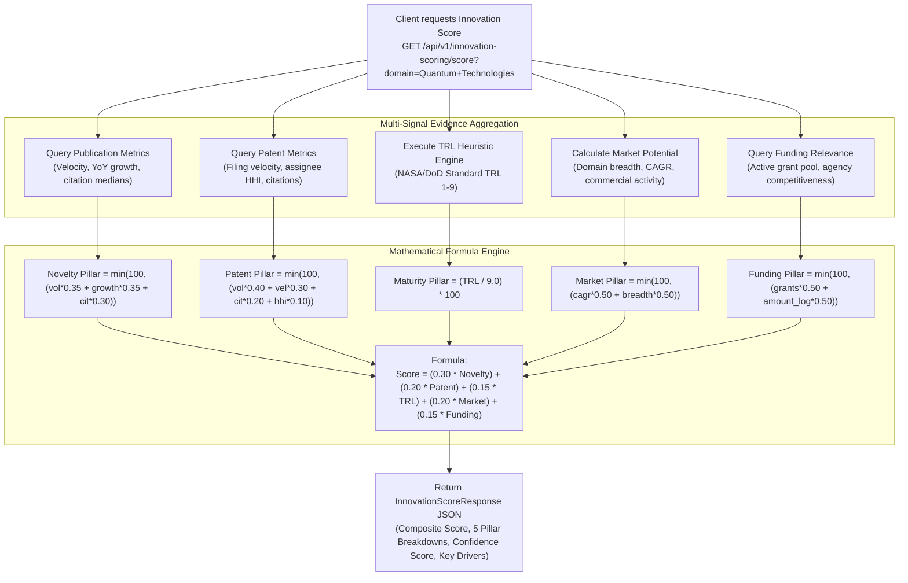

# 05_ARCHITECTURE.md — System Architecture & Data Flow

## 1. High-Level Architecture Diagram

The **Research Funding & Innovation Intelligence Platform** follows a decoupled, asynchronous, service-oriented architecture:

---

## 2. Request Lifecycle

1. **Client Dispatch:**  
   The user interacts with the Next.js frontend (running on `http://localhost:3000`). Axios or standard `fetch` transmits an HTTP request with an `Authorization: Bearer <jwt_access_token>` header to the backend API (`http://localhost:8000/api/v1/...`).
2. **CORS & Middleware:**  
   FastAPI verifies the request origin against `settings.CORS_ORIGINS`.
3. **Authentication & RBAC Inspection (`app/core/deps.py`):**  
   - `oauth2_scheme` extracts the bearer token.
   - `decode_token()` cryptographically validates signature and expiration against `settings.JWT_SECRET` (`HS256`).
   - The user ID is fetched from PostgreSQL. If deactivated or invalid, an `AuthenticationFailedException` (HTTP 401) is returned.
   - Role dependencies (`require_roles([UserRole.ADMINISTRATOR, ...])`) verify authorization. Unauthorized access yields `PermissionDeniedException` (HTTP 403).
4. **Router Execution (`app/api/v1/endpoints/`):**  
   The endpoint function parses query parameters and validates request bodies against strict Pydantic v2 schemas.
5. **Business Logic Execution (`app/services/`):**  
   The endpoint delegates to asynchronous service classes (`ResearchTrendService`, `FundingService`, `InnovationScoringService`, etc.).
6. **Persistence Access (`app/core/database.py`):**  
   Services execute queries via `AsyncSessionLocal` using SQLAlchemy 2.0 async select/join expressions.
7. **Response Serialization:**  
   Database ORM objects are transformed into Pydantic response models and returned as JSON (or file streams for Markdown export).

---

## 3. Authentication & Session Flow

---

## 4. Intelligence & Scoring Engine Flow (Module 7)

---

## 5. External Harvester Flow & Error Handling

To ensure continuous operation without external dependencies:
1. **Timeout & Retries:** Every provider request uses a strict timeout (`settings.PROVIDER_TIMEOUT_SECONDS = 8.0s`) and up to 2 retries.
2. **Graceful Fallbacks:** If an external API is offline, rate-limited, or unconfigured, the provider catches the exception and returns curated fallback datasets without failing the client request.
3. **Data Normalization:** All providers normalize incoming external payloads into canonical Pydantic dataclasses (`NormalizedPublication`, `NormalizedFundingOpportunity`, `NormalizedPatent`).
4. **Deduplication:** DOIs, patent numbers, and grant opportunity IDs are checked against PostgreSQL before creating new records.

---

## 6. Integration Boundaries & File Organization

- **Frontend Application (`frontend/`):** Completely decoupled from backend internals. Interacts strictly via REST JSON over HTTP.
- **Backend Application (`backend/`):** Pure Python async application structured around Clean Architecture layers:
  - `app/api/v1/endpoints/`: Routing and HTTP transport.
  - `app/schemas/`: Data contracts and Pydantic validation.
  - `app/services/`: Reusable business logic.
  - `app/models/`: SQLAlchemy ORM entity definitions.
  - `app/core/`: Configuration, database engines, security, and dependencies.
