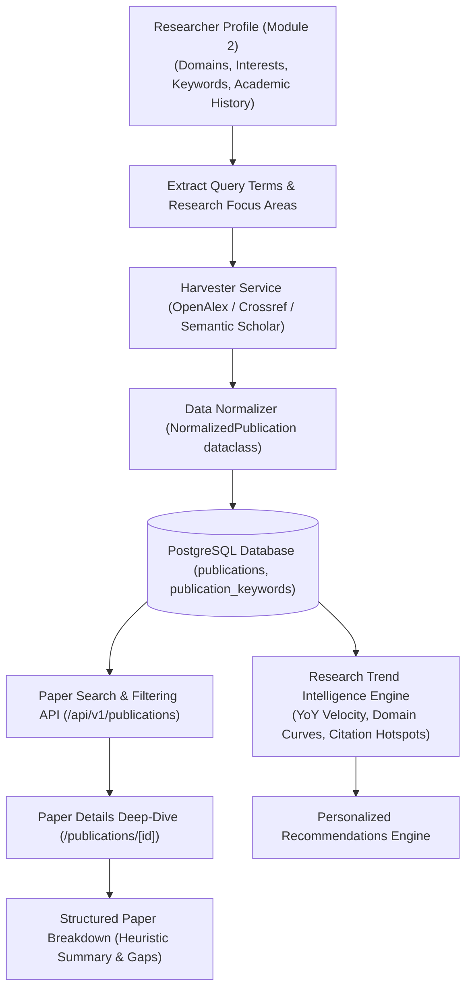

# 13_RESEARCH_INTELLIGENCE.md — Research Intelligence & Paper Analysis

> **MODULE NUMBERING CONTEXT:**  
> • Mentor Specification: **Module 3: Research Intelligence and Research Paper Analysis**  
> • Official Specification PDF: **Module 4: Research Trend Intelligence Module**

---

## 1. Planned Recommended End-to-End Workflow

---

## 2. Current Database Persistence Reality

> [!IMPORTANT]
> **VERIFIED REPOSITORY DATA AUDIT:**  
> A direct SQL query against the active PostgreSQL database (`research_intel_db`) reveals:  
> • **Only 2 publication records currently exist** in the `publications` table.  
> • **0 publication keywords** currently indexed.  
>  
> The research intelligence dashboards and trend calculations function reliably because:  
> 1. `ResearchTrendService` gracefully handles sparse and zero-row states using safe COALESCE and zero-division guards.  
> 2. Automated test suites (`test_research_intelligence.py`, `test_publications.py`, `test_providers.py`) populate temporary in-memory datasets during testing.  
> 3. Production data seeding / batch ingestion from OpenAlex or Semantic Scholar is queued as a next engineering action.

---

## 3. Database Schema for Research Literature

Defined in `backend/app/models/publication.py`:
- `id` (Integer, Primary Key)
- `title` (String(500), Not Null)
- `authors` (Text, JSON string or comma-separated author list)
- `abstract` (Text, Full-text scientific abstract)
- `publication_date` (Date, ISO 8601)
- `venue` (String(255), Journal, Conference, or Book title)
- `doi` (String(255), Unique Digital Object Identifier)
- `citation_count` (Integer, Forward citation counter)
- `primary_domain` (String(150), Standardized discipline tag)
- `source` (String(50), e.g., `openalex`, `semanticscholar`, `crossref`, `mock`)
- `external_id` (String(150), External API primary key)
- `url` (String(500), DOI link or publisher URL)
- Junction table `profile_publications` links users to publications (`profile_id`, `publication_id`, `is_primary_author`).

---

## 4. Backend Endpoints & Analytics Implementation

### 4.1. Literature Management (`backend/app/api/v1/endpoints/publications.py`)
- `GET /api/v1/publications`: Search publications by keyword, domain, venue, or year range.
- `POST /api/v1/publications`: Manually register a research paper.
- `POST /api/v1/publications/ingest`: Pass a DOI to query OpenAlex or Crossref and automatically persist the normalized paper.
- `GET /api/v1/publications/my`: Retrieve publications authored or bookmarked by the current user.
- `GET /api/v1/publications/{id}`: Fetch complete metadata for an individual paper.

### 4.2. Research Trends & Hotspots (`backend/app/api/v1/endpoints/research_intelligence.py`)
Implemented by `ResearchTrendService` in `backend/app/services/research_trend_service.py`:
- **Publication Velocity (`/trends/publications`):** Calculates annual publication volume and Year-over-Year (YoY) percentage change.
- **Domain Trends (`/trends/domains`):** Aggregates growth trajectories across scientific domains.
- **Citation Statistics (`/trends/citations`):** Computes total citations, average citations per paper, and identifies top-cited foundational works.
- **Emerging Topics (`/emerging-topics`):** Measures keyword acceleration (recent 2-year frequency compared to historical 5-year baseline).
- **Composite Research Hotspots (`/hotspots`):**  
  Computes a multi-signal score (0–100) using:
  - Volume Score (Max 40 pts) $= \min(40, \text{total\_pubs} \times 5)$
  - Growth Score (Max 35 pts) $= \min(35, \max(0, \text{YoY\_growth} \times 0.35))$
  - Citation Score (Max 25 pts) $= \min(25, \text{avg\_citations} \times 2.5)$
  - Classifies topics into: `CRITICAL_HOTSPOT`, `HIGH_ACTIVITY`, `MODERATE_ACTIVITY`, or `EMERGING_NICHE`.

---

## 5. Frontend Pages & Visual Components

- **`/publications`:** Interactive catalog supporting search, filtering by domain/year, and triggering the ingest modal.
- **`/publications/[id]`:** Detailed paper dossier displaying title, authors, publication date, DOI badge, citation badge, abstract, and external publisher links.
- **`/research-intelligence`:** Analytical dashboard with publication velocity charts, domain market-share cards, citation averages, and hotspot scorecards.
- **`/trends`:** Emerging topic velocity rankings and keyword trajectory visualizations.

---

## 6. Missing Items & Next Steps

1. **Batch Ingestion Script:** Execute a seeding script querying OpenAlex for 100+ papers across Quantum, Biotech, and Clean Energy to populate the empty PostgreSQL database.
2. **AI Analysis Expansion:** Integrate an LLM summarization pipeline that parses abstracts into explicit Problem, Methodology, Contributions, and Future Gaps sections.
3. **Vector Semantic Search:** Add `pgvector` to PostgreSQL to allow researchers to search papers by conceptual similarity rather than exact keywords.
