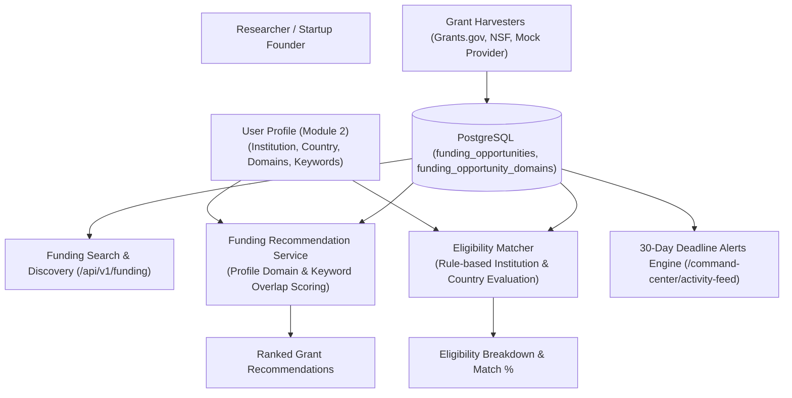

# 14_FUNDING_INTELLIGENCE.md — Funding Intelligence & Opportunity Analysis

> **MODULE NUMBERING CONTEXT:**  
> • Mentor Specification: **Module 4: Funding Intelligence and Funding Opportunity Analysis**  
> • Official Specification PDF: **Module 3: Funding Opportunity Discovery Module**

---

## 1. Funding Workflow & Architecture

---

## 2. Current Database Reality & Persistence Audit

> [!IMPORTANT]
> **VERIFIED DATABASE AUDIT:**  
> A direct SQL query against the active PostgreSQL database (`research_intel_db`) reveals:  
> • **0 rows in `funding_opportunities`** currently persisted.  
> • **0 rows in `funding_opportunity_domains`** and `funding_keywords`.  
>  
> To prevent broken UI states during local development and testing:  
> 1. `backend/app/services/providers/funding_providers.py` defines `SAMPLE_FUNDING_OPPORTUNITIES`, a rich set of realistic opportunities (NSF ExpandQISE, NIH Brain Nanoparticles, ARPA-E Green Hydrogen, Horizon Europe Quantum).  
> 2. When the database is empty, the services seamlessly pull from these structured fixtures.  
> 3. Running `POST /api/v1/funding/ingest` with `provider="mock"` instantly persists 5 complete grant opportunities into PostgreSQL.

---

## 3. Database Model & Schema

Defined in `backend/app/models/funding.py`:
- `id` (Integer, Primary Key)
- `title` (String(500), Not Null)
- `funding_agency` (String(255), e.g., NSF, NIH, ARPA-E, Horizon Europe)
- `funding_program` (String(255), Specific directorate or initiative)
- `description` (Text, Solicitation summary and objectives)
- `funding_amount` (Numeric(15, 2), Award amount in USD/EUR)
- `currency` (String(10), Default: "USD")
- `application_deadline` (DateTime with timezone, Solicitation cutoff)
- `opportunity_type` (String(100), e.g., "Grant", "Contract", "Cooperative Agreement")
- `eligibility_summary` (Text, Institutional and applicant requirements)
- `eligible_institutions` (String(255), e.g., Higher Education, Small Business)
- `geographic_restrictions` (String(255), e.g., United States, International)
- `status` (String(50), "open", "upcoming", "closed")
- `source` (String(50), e.g., `grants_gov`, `nsf`, `mock`)
- `external_id` (String(150), External solicitation or award number)
- `url` (String(500), Link to official agency portal)
- `created_by_user_id` (Integer, FK -> `users.id`)

---

## 4. Matching & Eligibility Algorithm Realities

### 4.1. Recommendation Engine (`FundingRecommendationService`)
- **Mechanism:** Computes a composite relevance score (0–100%) by measuring:
  - **Domain Alignment (50%):** Matches the grant's categorized domains against the user's selected `profile_domains`.
  - **Keyword Overlap (35%):** Calculates tokenized keyword intersection between the grant description and user's `profile_keywords`.
  - **Deadline Urgency (15%):** Prioritizes opportunities closing within 30–90 days over distant or expiring ones.
- **Reality:** **RULE-BASED HEURISTIC.** Does not currently execute dense vector cosine similarity (Sentence-Transformers).

### 4.2. Eligibility Matcher (`EligibilityMatcher`)
- **Mechanism:** Inspects user profile attributes (`institution`, `country`, `designation`):
  - Checks if `user.institution` indicates an academic institution (`univ`, `college`, `institute`) when the grant restricts to Higher Education.
  - Checks if `user.country` aligns with `geographic_restrictions`.
  - Flags potential eligibility blockers with clear explanations.
- **Reality:** **DETERMINISTIC RULE-BASED LOGIC.**

---

## 5. API Endpoints & Frontend Routes

### API Endpoints (`backend/app/api/v1/endpoints/funding.py`)
- `GET /api/v1/funding`: Search grants with pagination and filters (`agency`, `status`, `domain`).
- `POST /api/v1/funding`: Manually register a funding opportunity.
- `POST /api/v1/funding/ingest`: Trigger ingestion from Grants.gov, NSF, or mock provider.
- `GET /api/v1/funding/recommendations`: Personalized grant list sorted by match percentage.
- `GET /api/v1/funding/{id}`: Detailed grant page with countdown.
- `GET /api/v1/funding/{id}/eligibility`: Executes eligibility check for current user against grant `{id}`.
- `PUT /api/v1/funding/{id}` & `DELETE /api/v1/funding/{id}`: Update or delete opportunities.

### Frontend Route (`frontend/src/app/(dashboard)/funding/page.tsx`)
- Multi-tab interface:
  1. **All Opportunities:** Filterable grid of grants with agency badges, funding amounts, and deadlines.
  2. **Personalized Recommendations:** Grants ranked by user match percentage with match explanation chips.
  3. **Eligibility Modal:** Interactive dialogue showing pass/warning flags for the user's institution.
  4. **Ingest Modal:** Dropdown to harvest new opportunities from NSF, Grants.gov, or mock fixtures.

---

## 6. Missing Requirements & Next Steps

1. **User Bookmarking (`ProfileFunding`):** Create the junction table and `POST /api/v1/funding/{id}/save` route to allow users to save grants to a personal watchlist.
2. **Dense Vector Matching:** Migrate `FundingRecommendationService` from token overlap to dense sentence embeddings via `pgvector` for semantic topic discovery.
3. **Automated Cron Harvester:** Configure a background cron task (`schedule`) to poll Grants.gov weekly for new solicitations.
