# database/RELATIONSHIPS.md — Entity Relationships & Cascade Rules

---

## 1. Full Database Schema Relationship Diagram

```mermaid
erDiagram
    users ||--o| profiles : "1:1 user_id ON DELETE CASCADE"
    users ||--o{ refresh_tokens : "1:N user_id ON DELETE CASCADE"
    users ||--o{ funding_opportunities : "1:N created_by_user_id ON DELETE SET NULL"

    profiles ||--o{ profile_domains : "1:N profile_id ON DELETE CASCADE"
    research_domains ||--o{ profile_domains : "1:N domain_id ON DELETE CASCADE"

    profiles ||--o{ research_interests : "1:N profile_id ON DELETE CASCADE"
    profiles ||--o{ profile_keywords : "1:N profile_id ON DELETE CASCADE"
    profiles ||--o{ technology_areas : "1:N profile_id ON DELETE CASCADE"
    profiles ||--o{ academic_histories : "1:N profile_id ON DELETE CASCADE"
    profiles ||--o{ research_histories : "1:N profile_id ON DELETE CASCADE"

    profiles ||--o{ profile_publications : "1:N profile_id ON DELETE CASCADE"
    publications ||--o{ profile_publications : "1:N publication_id ON DELETE CASCADE"
    publications ||--o{ publication_keywords : "1:N publication_id ON DELETE CASCADE"

    profiles ||--o{ profile_patents : "1:N profile_id ON DELETE CASCADE"
    patents ||--o{ profile_patents : "1:N patent_id ON DELETE CASCADE"

    funding_opportunities ||--o{ funding_opportunity_domains : "1:N funding_opportunity_id ON DELETE CASCADE"
    research_domains ||--o{ funding_opportunity_domains : "1:N domain_id ON DELETE CASCADE"
    funding_opportunities ||--o{ funding_keywords : "1:N funding_opportunity_id ON DELETE CASCADE"
```

---

## 2. Foreign Key Cascade & Isolation Rules

1. **User Account Deletion (`users`):**  
   - Cascades to `profiles` (deleting user's extended profile).
   - Cascades to `refresh_tokens` (immediately invalidating any active sessions).
   - Sets `created_by_user_id = NULL` on `funding_opportunities` (preserving public funding data even if creator account is removed).
2. **Profile Deletion (`profiles`):**  
   - Cascades to `profile_domains`, `research_interests`, `profile_keywords`, `technology_areas`, `academic_histories`, and `research_histories`.
   - Cascades to junction bookmarks `profile_publications` and `profile_patents`.
   - Leaves underlying `publications` and `patents` intact in the shared catalog.
3. **Publication Deletion (`publications`):**  
   - Cascades to `profile_publications` (removing bookmarks across all users).
   - Cascades to `publication_keywords`.
4. **Patent Deletion (`patents`):**  
   - Cascades to `profile_patents` (removing bookmarks across all users).

---

## 3. Database Indexes

| Table | Indexed Columns | Index Type | Optimization Goal |
| :--- | :--- | :---: | :--- |
| `users` | `email` | UNIQUE B-Tree | Sub-millisecond user authentication lookup |
| `refresh_tokens` | `token_hash` | UNIQUE B-Tree | Fast token rotation verification & revocation check |
| `publications` | `doi` | UNIQUE B-Tree | Duplicate prevention during external paper ingestion |
| `publications` | `publication_date` | B-Tree | Fast temporal velocity queries in `ResearchTrendService` |
| `publications` | `primary_domain` | B-Tree | Rapid domain filtering across literature |
| `patents` | `patent_number` | UNIQUE B-Tree | Duplicate prevention during external patent ingestion |
| `patents` | `filing_date` | B-Tree | Fast patent trend velocity & CAGR calculations |
| `patents` | `technology_domain` | B-Tree | Quick domain grouping for whitespace discovery |
| `patents` | `assignee` | B-Tree | Fast assignee ranking & Herfindahl-Hirschman (HHI) queries |
| `funding_opportunities`| `application_deadline` | B-Tree | Fast sorting for upcoming 30-day deadline alerts |
| `funding_opportunities`| `funding_agency` | B-Tree | Filtering grants by agency (NSF, NIH, DOE) |
