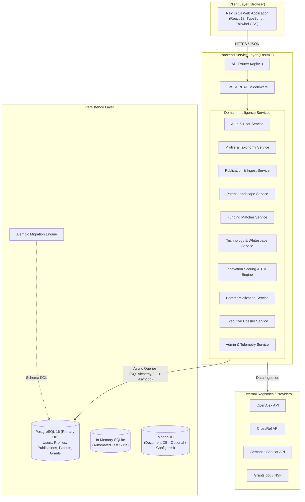

# Research Funding & Innovation Intelligence Platform

An enterprise-grade, full-stack intelligence platform designed to bridge academic research, intellectual property (patents), grant funding discovery, and commercial market pathways. The platform features deep-tech whitespace discovery, multi-factor patent landscape analysis, and an objective 5-pillar mathematical innovation scoring framework.

---

## Table of Contents

- [Overview](#overview)
- [Current Project Status](#current-project-status)
- [Key Features](#key-features)
- [User Roles & RBAC](#user-roles--rbac)
- [System Architecture](#system-architecture)
- [Technology Stack](#technology-stack)
- [Repository Structure](#repository-structure)
- [Getting Started](#getting-started)
  - [Prerequisites](#prerequisites)
  - [1. Database Setup (Docker PostgreSQL)](#1-database-setup-docker-postgresql)
  - [2. Backend Setup & Migrations](#2-backend-setup--migrations)
  - [3. Administrator Account Provisioning](#3-administrator-account-provisioning)
  - [4. Frontend Setup](#4-frontend-setup)
- [Running Automated Tests](#running-automated-tests)
  - [Backend Test Suite (Pytest)](#backend-test-suite-pytest)
  - [Frontend Test Suite (Vitest)](#frontend-test-suite-vitest)
  - [Next.js Production Build](#nextjs-production-build)
- [API Reference](#api-reference)

---

## Overview

Modern scientific innovation often faces significant friction transitioning from lab discovery to market application. Researchers struggle to identify non-dilutive grant capital, startup founders lack visibility into prior-art patent density, and Technology Transfer Offices (TTOs) lack quantitative metrics to benchmark portfolio readiness.

The **Research Funding & Innovation Intelligence Platform** unifies these disparate workflows into a single data-driven ecosystem:

- **Research Intelligence**: Normalizes publications from multi-provider academic registries (OpenAlex, Crossref, Semantic Scholar) and analyzes citation velocity, publication growth rates, and emerging topic hotspots.
- **Patent Landscape Intelligence**: Tracks competitive filings, IPC classification concentration (Herfindahl-Hirschman Index), and assignee distribution.
- **Technology Intelligence & Whitespace Discovery**: Identifies unpatented innovation niches and technology coverage gaps using density metrics and CAGR trajectory analysis.
- **Multi-Factor Innovation Scoring & TRL Engine**: Calculates deterministic innovation scores across 5 weighted empirical pillars and estimates Technology Readiness Levels (TRL 1–9).
- **Commercialization Advisory**: Synthesizes market demand, licensing recommendations, spinout feasibility, and strategic next steps.
- **Executive Dossiers & Command Center**: Delivers strategic decision support and role-scoped analytics across Researchers, Founders, Innovation Managers, and Administrators.

---

## Current Project Status

| Functional Area | Status | Notes |
| :--- | :---: | :--- |
| **Authentication & Session Security** | ✅ Complete | JWT access tokens + persistent refresh token rotation |
| **Role-Based Access Control (RBAC)** | ✅ Complete | 4 distinct roles; backend authorization dependencies |
| **Public Registration Guardrails** | ✅ Complete | Public self-registration restricted to non-admin roles |
| **Administrator Provisioning** | ✅ Complete | Dedicated server-side CLI & role promotion workflows |
| **Research Profile Management** | ✅ Complete | Multi-domain taxonomy, interests, keywords, history |
| **Publication Ingestion & Catalog** | ✅ Complete | Multi-provider API ingest, deduplication, full CRUD |
| **Patent Portfolio & Landscape** | ✅ Complete | Patent normalization, assignee ranking, IPC analytics |
| **Funding Discovery & Matching** | ✅ Complete | Semantic eligibility engine & relevance ranking |
| **Research Intelligence & Trends** | ✅ Complete | Historical publication velocity & domain hotspots |
| **Technology Whitespace Radar** | ✅ Complete | Density mapping & gap discovery analytics |
| **5-Pillar Innovation Scoring** | ✅ Complete | Deterministic weighted scoring + TRL 1–9 rule engine |
| **Commercialization Readiness** | ✅ Complete | Multi-dimensional commercialization & strategy paths |
| **Executive Reports & Export** | ✅ Complete | Comprehensive dossier synthesis, JSON/MD export |
| **Admin Command Center & Telemetry** | ✅ Complete | Pipeline health monitoring, user governance, audit logs |
| **Module 3+ Mentor Specific Additions** | ⏳ Pending | Scheduled per project roadmap and evaluation cycles |

---

## Key Features

### 1. Authentication & Security
- **JWT & Persistent Refresh Token Rotation**: Secure token generation (`python-jose`), Bcrypt password hashing (`passlib`), and automatic token renewal.
- **Cross-User Data Isolation**: Profile-scoped authorization preventing cross-user mutation or data leakage across publications, patents, and scoring data.
- **Hardened RBAC**: Route guards on both FastAPI backend dependencies (`require_roles`) and Next.js client-side navigation.

### 2. User & Research Profile Management
- **8 Core Profile Facets**: Institution, department, designation, country, phone, biography, ORCID identifier, and website.
- **Hierarchical Research Taxonomy**: Domain taxonomy linking Many-to-Many via `profile_domains`, One-to-Many `research_interests`, `profile_keywords`, `technology_areas`, `academic_histories`, and `research_histories`.

### 3. Publication Management & Multi-Source Ingestion
- **Automated Ingestion Pipeline**: Ingests and normalizes scholarly records from OpenAlex, CrossRef, and Semantic Scholar with fallback to mock connectors.
- **Idempotent Storage**: DOI normalization and duplicate prevention.
- **Full Catalog Lifecycle**: Search, domain filtering, citation tracking, and author attribution.

### 4. Patent Intelligence & Prior-Art Analytics
- **Patent Portfolio Management**: Manual creation, external registry ingest, and interactive editing modal.
- **Landscape Analytics**: Assignee market concentration (HHI), IPC classification distribution, filing velocity, and competitive litigation indicators.

### 5. Semantic Funding Matchmaking
- **Eligibility Engine**: Multi-factor matcher comparing research domains, keywords, and geographic eligibility criteria against grant opportunities (e.g., Grants.gov, NSF).
- **Match Scoring**: Deterministic scoring and clear human-readable eligibility rationales.

### 6. Technology Intelligence & Whitespace Discovery
- **Activity & Growth Trajectories**: Compound Annual Growth Rate (CAGR) calculations and temporal activity tracking.
- **Whitespace Gap Detection**: Identifies sparse technology niches with high research activity but low patent concentration.

### 7. Innovation Scoring & TRL Engine
- **5-Pillar Innovation Formula**:
  $$\text{Innovation Score} = (0.30 \times \text{Novelty}) + (0.20 \times \text{Patent}) + (0.15 \times \text{TRL}) + (0.20 \times \text{Market}) + (0.15 \times \text{Funding})$$
- **TRL Rule Engine**: Maps empirical artifact signals to NASA/DoD standard Technology Readiness Levels (TRL 1: Basic Principles to TRL 9: Operational Deployment).

### 8. Commercialization & Strategic Advisory
- **Readiness Breakdown**: Evaluates IP defensibility, market demand, regulatory hurdles, and team capability.
- **Pathway Recommendations**: Generates tailored strategies for Direct Licensing, Venture Spinouts, or Joint Development.

### 9. Executive Dossier & Command Center
- **Cross-Domain Benchmarking**: Portfolio-wide summaries and comparative performance indices.
- **Multi-Stream Activity Feeds**: Unified event timelines and upcoming grant deadline trackers.
- **Data Export**: Complete analytical dossiers downloadable as Markdown or structured JSON.

---

## User Roles & RBAC

The platform enforces 4 distinct platform roles:

| Role | Target Persona | Primary Permissions & Capabilities | Public Registration |
| :--- | :--- | :--- | :---: |
| **Researcher** | Academic & Scientific Faculty | Grant matchmaking, publication management, novelty scoring | ✅ Allowed |
| **Startup Founder** | Deep-Tech Entrepreneurs | Whitespace discovery, patent landscaping, non-dilutive capital radar | ✅ Allowed |
| **Innovation Manager** | TTO Directors & IP Officers | Portfolio TRL benchmarking, commercialization pipelines, institutional reports | ✅ Allowed |
| **Administrator** | Platform Governance & IT | User role assignment, user activation/deactivation, pipeline telemetry, system audit | ❌ **Forbidden** |

### Registration & Security Enforcement
1. **Public Self-Registration (`/register`)**: Only permits selecting `Researcher`, `Startup Founder`, or `Innovation Manager`.
2. **Backend Defense-in-Depth**: `POST /api/v1/auth/register` explicitly rejects payloads containing `role="administrator"` with `HTTP 403 Forbidden` (`PERMISSION_DENIED`).
3. **Admin Provisioning**: Administrator accounts must be provisioned through direct server-side CLI execution (`scripts/create_admin.py`) or promoted by an existing Administrator via `PUT /api/v1/admin/users/{id}/role`.

---

## System Architecture



- **Primary Relational Store**: PostgreSQL 16 managed with SQLAlchemy 2.0 Async ORM and asyncpg driver.
- **Migration Layer**: Alembic versioning ensuring fully reproducible, transactional schema updates.
- **Test Database**: In-memory SQLite (`sqlite+aiosqlite:///:memory:`) for fast, isolated test execution.
- **Document Store (Configured)**: MongoDB connection parameters configured for future document indexing pipelines.

---

## Technology Stack

### Backend
- **Framework**: FastAPI `0.111.0`, Starlette
- **ASGI Server**: Uvicorn `0.30.1` (with standard workers)
- **Data Validation & Settings**: Pydantic `2.7.4`, Pydantic-Settings `2.3.4`
- **ORM & Database Driver**: SQLAlchemy `2.0.31` (Async), Asyncpg `0.29.0`, aiosqlite `0.20.0`
- **Database Migrations**: Alembic `1.13.2`
- **Security & Cryptography**: Python-Jose `3.3.0` (Cryptographic JWT), Passlib `1.7.4` (Bcrypt `4.0.1`), Python-Multipart `0.0.9`
- **Testing**: Pytest `8.2.2`, Pytest-Asyncio `0.23.7`, HTTPX `0.27.0`

### Frontend
- **Framework**: Next.js `14.2.4` (App Router, Server Components & Client Hooks)
- **UI Library**: React `18.3.1`, React DOM `18.3.1`
- **Language**: TypeScript `5.4.5`
- **Styling**: Tailwind CSS `3.4.4`, PostCSS `8.4.38`, Autoprefixer `10.4.19`, Tailwind-Merge `2.3.0`, Clsx `2.1.1`
- **Icons**: Lucide React `0.395.0`
- **HTTP Client**: Axios `1.7.2`
- **Testing**: Vitest `4.1.11`

### Infrastructure & Tooling
- **Database**: PostgreSQL `16-alpine` (Docker)
- **Containerization**: Docker Compose (`docker-compose.yml`)

---

## Repository Structure

```text
Research-Funding-Innovation-Intelligence-Platform/
├── backend/
│   ├── alembic/                      # Alembic database migration scripts & versions
│   │   ├── versions/                 # 6 migration revisions (head: 244ef6c34a82)
│   │   └── env.py                    # Async migration environment configuration
│   ├── app/
│   │   ├── api/v1/
│   │   │   ├── endpoints/            # FastAPI endpoint controllers (auth, profile, admin, etc.)
│   │   │   └── api_router.py         # Master v1 router aggregating all endpoints
│   │   ├── core/                     # Config, security, exceptions, dependency injection
│   │   ├── models/                   # SQLAlchemy ORM database models (User, Profile, Patent, etc.)
│   │   ├── schemas/                  # Pydantic v2 validation & response models
│   │   ├── services/                 # Core intelligence engines, scoring, and analytics logic
│   │   │   └── providers/            # External academic & grant connector adapters
│   │   └── main.py                   # FastAPI application initialization & middleware
│   ├── scripts/
│   │   └── create_admin.py           # Administrative account provisioning CLI
│   ├── tests/                        # 23 Pytest async test modules (150 test cases)
│   │   └── conftest.py               # Shared test fixtures & in-memory database setup
│   ├── alembic.ini                   # Alembic configuration
│   └── requirements.txt              # Python dependency manifest
├── frontend/
│   ├── src/
│   │   ├── app/                      # Next.js 14 App Router pages and layouts
│   │   │   ├── (auth)/               # Authentication route group (/login, /register)
│   │   │   ├── (dashboard)/          # Authenticated platform pages (/dashboard, /profile, /admin, etc.)
│   │   │   ├── globals.css           # Design tokens, custom utilities, scrollbar styling
│   │   │   ├── layout.tsx            # Global HTML root layout
│   │   │   └── page.tsx              # Public hero landing page
│   │   ├── components/               # Reusable UI primitives (Input, Button, Badge, Modal, etc.)
│   │   ├── lib/                      # Axios client instance, auth storage, test contracts
│   │   └── types/                    # TypeScript interfaces for API models and telemetry
│   ├── package.json                  # Frontend dependencies and npm scripts
│   ├── tsconfig.json                 # TypeScript compiler configuration
│   ├── tailwind.config.ts            # Tailwind color palette and plugin setup
│   └── vitest.config.ts              # Vitest test runner configuration
├── .env.example                      # Reference environment variable template
├── .gitignore                        # Git exclusion rules
├── docker-compose.yml                # PostgreSQL 16 container definition
└── README.md                         # Project documentation
```

---

## Getting Started

### Prerequisites
- **Python**: Version 3.10 or higher
- **Node.js**: Version 18.x or higher (npm included)
- **Docker & Docker Compose**: For running the local PostgreSQL container

---

### 1. Database Setup (Docker PostgreSQL)

Start the PostgreSQL 16 container using Docker Compose:

```bash
docker-compose up -d
```

Verify that the container is healthy:
```bash
docker ps
```

---

### 2. Backend Setup & Migrations

Navigate to the `backend` directory, create a Python virtual environment, and install dependencies:

```bash
cd backend

# Create and activate virtual environment
python -m venv venv

# Windows (PowerShell)
.\venv\Scripts\Activate.ps1

# Linux / macOS
source venv/bin/activate

# Install dependencies
pip install -r requirements.txt
```

Create a `.env` file in the project root based on `.env.example`:
```bash
cp ../.env.example ../.env
```

Apply database migrations to the PostgreSQL database:
```bash
alembic upgrade head
```

Start the FastAPI backend server:
```bash
uvicorn app.main:app --host 127.0.0.1 --port 8000 --reload
```

Interactive API documentation will be available at:
- **Swagger UI**: `http://localhost:8000/docs`
- **ReDoc**: `http://localhost:8000/redoc`

---

### 3. Administrator Account Provisioning

Because public self-registration with the `administrator` role is strictly disabled for security, provision the primary administrator account using the dedicated CLI script:

```bash
# In the backend directory with active virtual environment:
python scripts/create_admin.py --email admin@platform.gov --password SecureAdminPassword123! --name "Platform Administrator"
```

---

### 4. Frontend Setup

In a new terminal window, navigate to the `frontend` directory and install dependencies:

```bash
cd frontend
npm install
```

Start the Next.js development server:
```bash
npm run dev
```

The web application is now accessible at:
- **Web Application**: `http://localhost:3000`
- **Registration Page**: `http://localhost:3000/register`
- **Login Page**: `http://localhost:3000/login`

---

## Running Automated Tests

### Backend Test Suite (Pytest)
The backend test suite runs against an isolated in-memory SQLite database and tests all authentication, RBAC, domain intelligence, scoring, commercialization, and administration endpoints.

```bash
# In the backend directory with active virtual environment:
pytest tests/ -v
```
*Current test suite: **150 passed in ~60s***.

### Frontend Test Suite (Vitest)
The frontend test suite tests API models, profile contracts, role isolation, and utility logic:

```bash
# In the frontend directory:
npm test
```
*Current test suite: **30 passed in ~500ms***.

### Next.js Production Build
To validate TypeScript types, ESLint rules, and static route generation:

```bash
# In the frontend directory:
npm run build
```
*Current build status: **18/18 static and dynamic routes compiled successfully***.

---

## API Reference

The backend exposes a modular REST API prefixed under `/api/v1`:

| Router Prefix | Tag | Description | Access Level |
| :--- | :--- | :--- | :--- |
| `/api/v1/health` | Health | Service readiness & liveness health check | Public |
| `/api/v1/auth` | Authentication | Registration, Login, Token Refresh, Logout, User Profile | Public / Authenticated |
| `/api/v1/profile` | Research Profile | User profile facets, research domains taxonomy, academic history | Authenticated |
| `/api/v1/publications` | Publications | Publication CRUD, catalog search, multi-provider ingestion | Authenticated |
| `/api/v1/patents` | Patents | Patent portfolio management, registry ingest, interactive edit | Authenticated |
| `/api/v1/funding` | Funding | Grant discovery, semantic eligibility matcher, recommendations | Authenticated |
| `/api/v1/research-intelligence` | Research Intel | Publication velocity, citation statistics, emerging topic hotspots | Authenticated |
| `/api/v1/patent-intelligence` | Patent Intel | Landscape analytics, HHI concentration, assignee ranking | Authenticated |
| `/api/v1/technology-intelligence` | Tech Intel | Whitespace discovery, coverage density, CAGR growth trajectories | Authenticated |
| `/api/v1/innovation-scoring` | Innovation & TRL | 5-pillar mathematical innovation scoring, TRL 1–9 estimation | Authenticated |
| `/api/v1/commercialization` | Commercialization | Commercialization readiness dimensions, strategic pathways | Authenticated |
| `/api/v1/reports` | Executive Reports | Executive intelligence dossier synthesis, Markdown & JSON export | Authenticated |
| `/api/v1/command-center` | Command Center | Role-tailored KPIs, multi-stream activity feeds, grant deadlines | Authenticated |
| `/api/v1/admin` | Administration | User governance, role mutation, connector telemetry, audit logs | Administrator Only |
